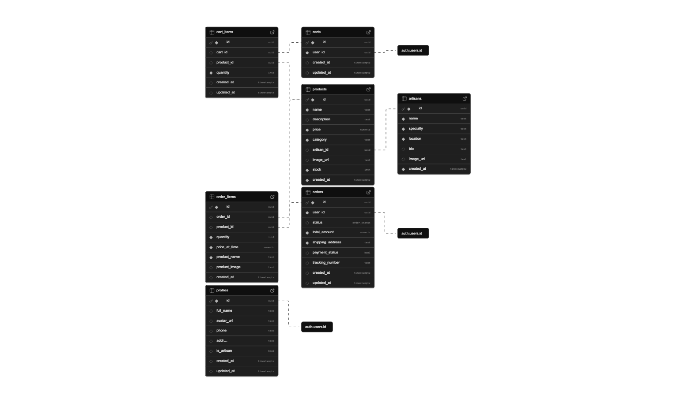
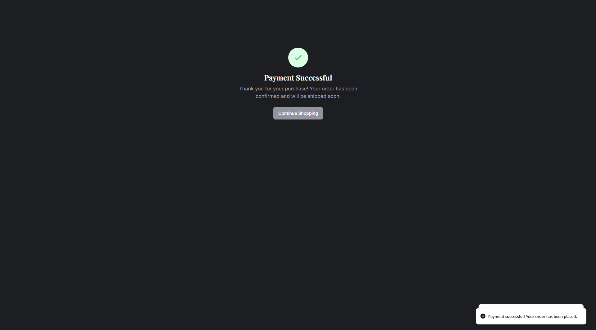
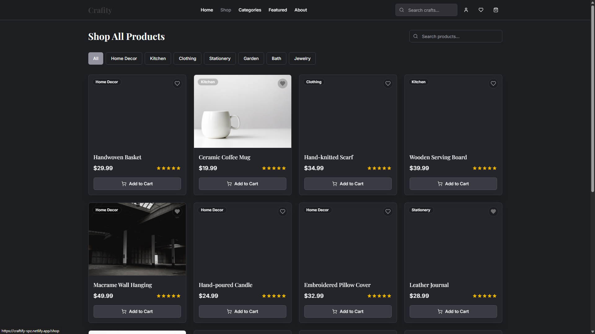
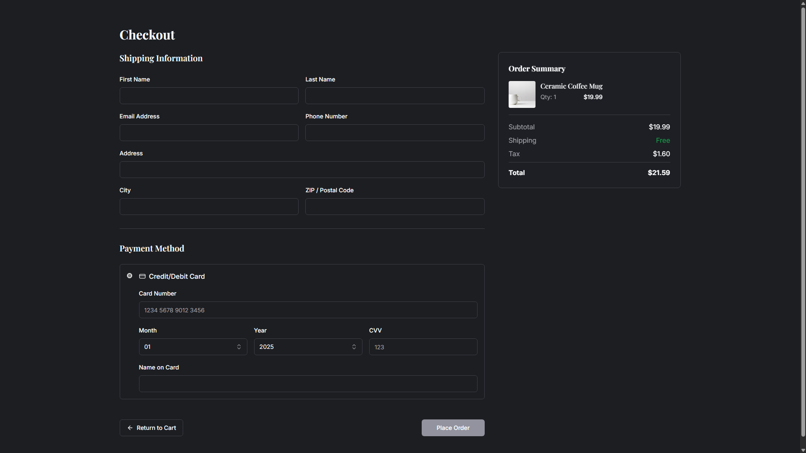

# 🛠️ Craftify

**Craftify** is a professional, minimal web application built as a **college-level mini project**. It features a secure user authentication system and a responsive dashboard using **React** and **Supabase**.

> Developed by **Yugabharathi J** [@yugabharathi21](https://github.com/yugabharathi21)

---

## ✨ Features

- 🔐 User Sign Up & Login (Email/Password)
- 🧭 Responsive Dashboard Interface
- ⚙️ Authenticated Route Protection
- 🎯 Minimal & Clean UI
- ⚡ Built with React + Vite for fast performance
- ☁️ Supabase for backend/authentication

---

## 📸 Preview

Here are some screenshots of Craftify in action:

<p float="left">
  
  
  
</p>

<p float="left">
  
  
</p>

---

## 🧰 Tech Stack

- **Frontend**: [React](https://reactjs.org/), [Vite](https://vitejs.dev/)
- **Styling**: [Tailwind CSS](https://tailwindcss.com/)
- **Backend / Auth**: [Supabase](https://supabase.com/)
- **Deployment**: Vercel / Netlify *(Optional)*

---

## 🚀 Getting Started

### 1. Clone the repository

```bash
git clone https://github.com/yugabharathi21/craftify.git
cd craftify
2. Install dependencies
bash
Copy
Edit
npm install
3. Set up Supabase
Create an account at supabase.com

Create a new project

Enable Email Authentication

Copy your SUPABASE_URL and SUPABASE_ANON_KEY

Create a .env file in the root:

env
Copy
Edit
VITE_SUPABASE_URL=https://your-project.supabase.co
VITE_SUPABASE_ANON_KEY=your-anon-key
4. Start the development server
bash
Copy
Edit
npm run dev
The app will be running at: http://localhost:5173

📁 Folder Structure
bash
Copy
Edit
craftify/
├── Demo_images/         # Project screenshots
│   ├── 1.png
│   ├── 2.png
│   ├── 3.png
│   ├── 4.png
│   └── 5.png
├── public/
├── src/
│   ├── components/      # Reusable UI components
│   ├── pages/           # Page components (Login, Dashboard, etc.)
│   ├── services/        # Supabase config and helpers
│   ├── App.jsx
│   └── main.jsx
├── .env
├── index.html
├── package.json
└── README.md
🔐 Authentication Flow
Supabase handles user login/sign-up using email and password.

Session persistence is managed on the client using Supabase's auth module.

Authenticated routes are protected with conditional rendering and redirects.

📦 Available Scripts
Command	Description
npm run dev	Run development server
npm run build	Build for production
npm run preview	Preview production build locally

🙋‍♂️ Author
Yugabharathi J
GitHub

📄 License
This project is licensed under the MIT License. See the LICENSE file for details.

💡 Future Enhancements
🌙 Dark mode toggle

📨 Email verification

📊 Enhanced dashboard analytics

🧪 Unit testing

Craftify is a personal educational project and is open to contributions and feedback!

yaml
Copy
Edit

---

### ✅ Notes:
- If you push this to GitHub, make sure the `Demo_images/` folder is committed and not ignored by `.gitignore`.
- If GitHub doesn’t display local image paths immediately, refresh the page or use raw links for absolute paths.

Would you like a downloadable `.md` file or help deploying the project too?
